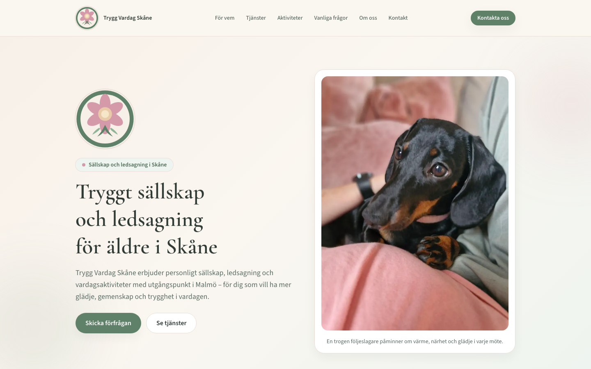
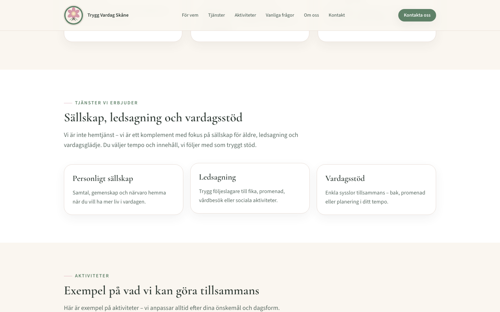
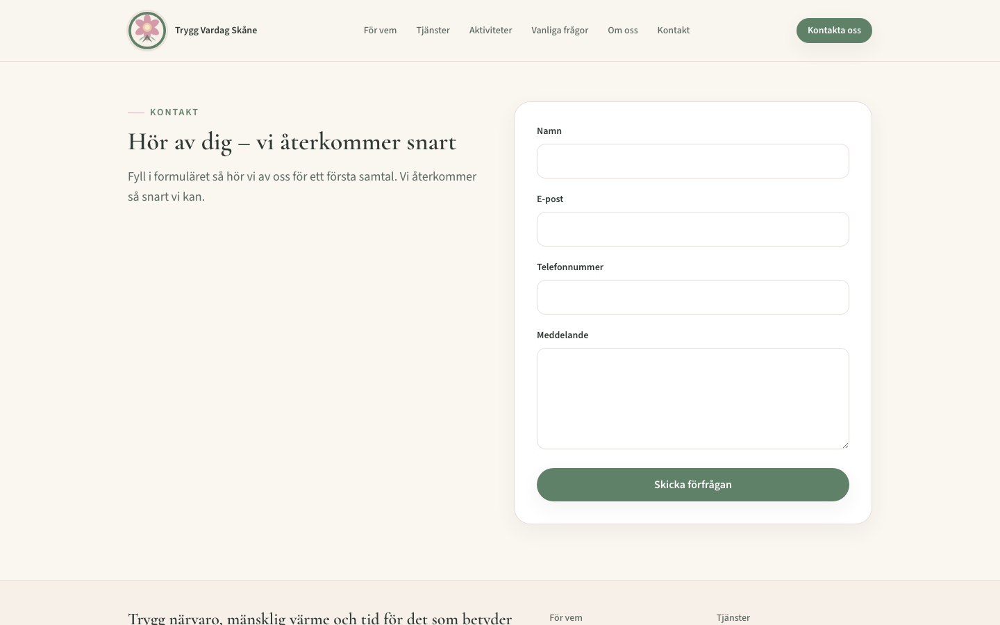
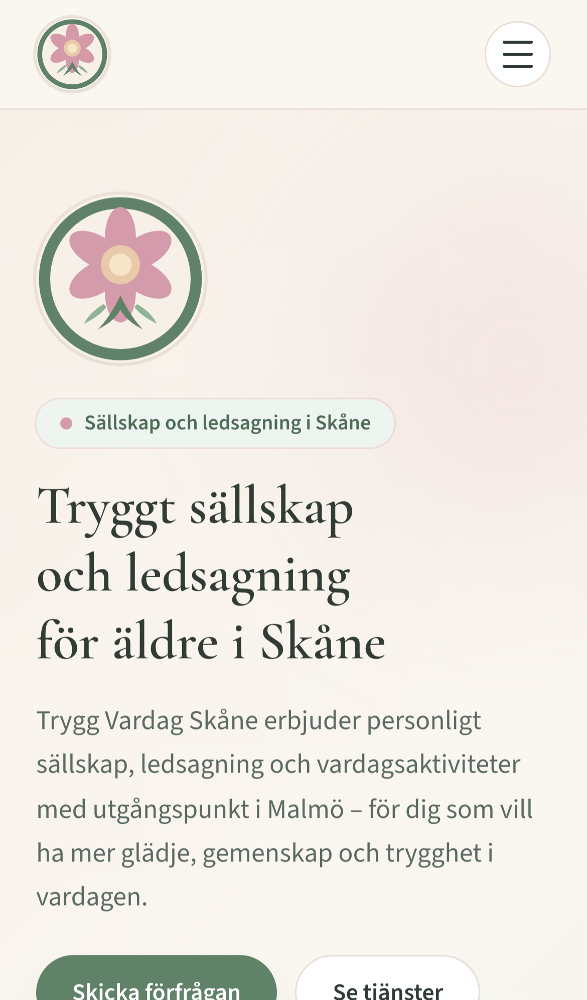
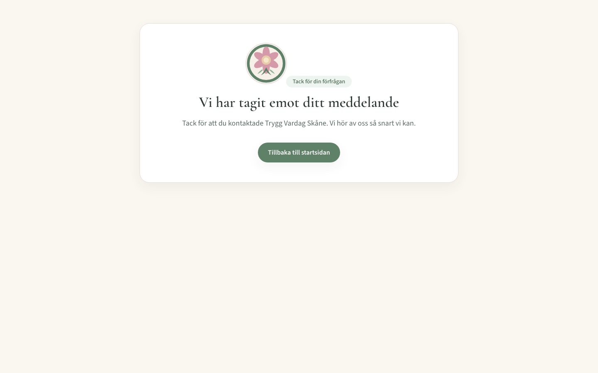

# Trygg Vardag Skåne — marketing website

Modern, accessible landing page for **Trygg Vardag Skåne**, a Swedish concept offering senior companionship, escort support, and everyday activities in Skåne. Built with Next.js, Tailwind CSS, structured SEO, and a Web3Forms-powered contact flow deployed on Netlify.

## Live demo

**https://trygg-vardag-skane.netlify.app**

## Highlights

- Warm, senior-friendly visual design with responsive layout and mobile navigation
- Clear service storytelling: who it is for, offerings, activities, FAQ, and contact
- SEO-ready metadata, Open Graph images, `sitemap.xml`, `robots.txt`, and JSON-LD (`LocalBusiness`, `Service`, `WebSite`)
- Accessible patterns: skip link, keyboard-friendly navigation, visible focus states, semantic sections
- Contact form via [Web3Forms](https://web3forms.com) with dedicated thank-you route (`/tack`)

## Screenshots

| Home (desktop) | Services |
| --- | --- |
|  |  |

| Contact | Mobile home |
| --- | --- |
|  |  |

| Thank-you page |
| --- |
|  |

## Tech stack

- **Next.js 16** (App Router, static generation)
- **React 19** + **TypeScript**
- **Tailwind CSS 4**
- **Netlify** (`@netlify/plugin-nextjs`)
- **Web3Forms** (contact submissions)

## Project structure

```text
src/
  app/           # Routes, metadata, global styles
  components/    # UI sections (header, forms, FAQ, cards)
  lib/           # Site config and content data
brand/           # Logo source assets
docs/screenshots # README visuals
```

## Local development

```bash
git checkout portfolio
cp .env.example .env.local
npm install
npm run dev
```

Open [http://localhost:3000](http://localhost:3000).

### Environment variables

| Variable | Required | Description |
| --- | --- | --- |
| `NEXT_PUBLIC_SITE_URL` | Recommended | Canonical public URL for SEO metadata |
| `NEXT_PUBLIC_WEB3FORMS_ACCESS_KEY` | Required for form | Web3Forms access key |

### Contact form setup (production)

1. Create an access key at [web3forms.com](https://web3forms.com)
2. In Netlify: **Site configuration → Environment variables**
3. Add `NEXT_PUBLIC_WEB3FORMS_ACCESS_KEY`
4. Trigger a new deploy
5. Submit the live form and confirm redirect to `/tack` plus inbox delivery

> Netlify Forms is not used here because this Next.js app handles submissions through Web3Forms from the client.

## Scripts

```bash
npm run dev          # local development
npm run build        # production build
npm run start        # run production build locally
npm run lint         # ESLint
npm run screenshots  # capture README screenshots (requires build + Playwright browsers)
```

To install Playwright browsers once:

```bash
npx playwright install chromium
npm run build && npm run screenshots
```

## Deployment (Netlify)

The site is configured via `netlify.toml`:

- Build command: `npm run build`
- Next.js runtime: `@netlify/plugin-nextjs`
- `NEXT_PUBLIC_SITE_URL` is set for production metadata

Connect the GitHub repository to Netlify (branch: `portfolio`) or deploy manually from the Netlify dashboard.

## Branching

| Branch | Purpose |
| --- | --- |
| `portfolio` | Current marketing site (v2.x) |
| `main` | Historical customer-project lineage |

## License

Private portfolio / concept project. All rights reserved unless otherwise stated by the repository owner.
